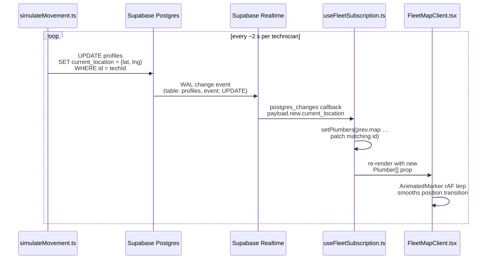
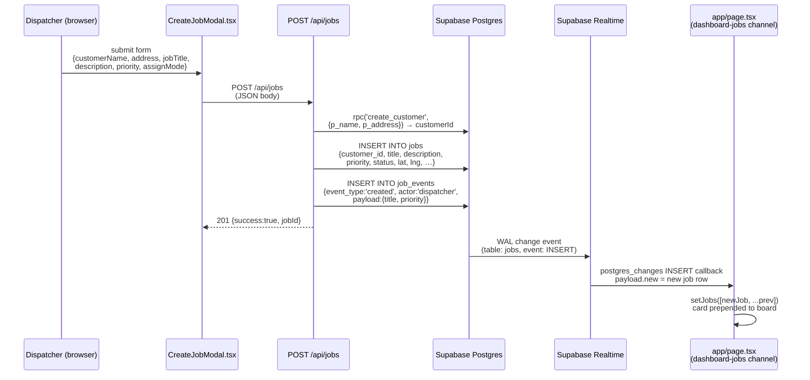
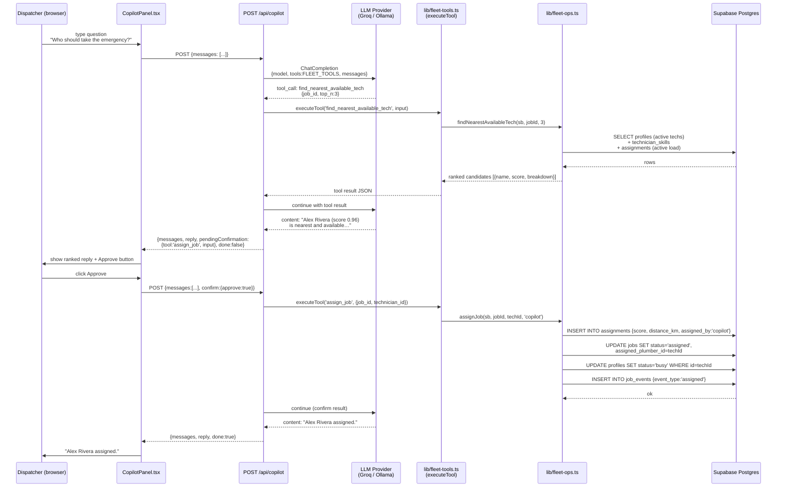

# Lapras — Logical Structure

---

## The Three-Layer Model

Lapras is organized in three additive layers. A regenerating LLM should build
them in this order because each layer depends only on the one below it:

1. **Core** — Next.js App Router dashboard + Supabase relational schema
   (`profiles`, `jobs`, `customers`) + Realtime subscriptions + Supabase Auth.
   This layer alone is a usable dispatch board.

2. **Agentic** — a shared `lib/fleet-ops` core exposed twice: as a standalone
   **MCP server** (stdio, `@modelcontextprotocol/sdk`) and as the **copilot**
   route (OpenAI-compatible tool-calling loop, provider-neutral via
   `LLM_PROVIDER`). The pure, unit-tested **assignment scoring algorithm**
   (`lib/scoring.ts`) lives here.

3. **Analytics / Audit** — additive schema (`skills`, `technician_skills`,
   `assignments`, `job_events`) + three SQL views (`v_technician_utilization`,
   `v_job_response_times`, `v_sla_breaches`) + the `/analytics` KPI dashboard +
   the live `job_events` activity feed.

---

## Architecture Diagram

```mermaid
graph TD
    subgraph Browser["Browser (client components)"]
        D[Dashboard<br/>app/page.tsx]
        FL[Fleet map<br/>app/fleet/page.tsx]
        AN[Analytics<br/>app/analytics/page.tsx]
        CP[Copilot panel<br/>CopilotPanel.tsx]
    end

    subgraph NextRoutes["Next.js Route Handlers (server)"]
        RJ[POST /api/jobs]
        RJP[PATCH /api/jobs/{id}]
        RC[POST /api/copilot]
        RA[GET /auth/callback]
    end

    subgraph Supabase["Supabase (hosted Postgres)"]
        PG[(Postgres<br/>7 tables + 3 views)]
        RT[Realtime<br/>postgres_changes]
        AU[Auth<br/>PKCE]
    end

    subgraph AgentLayer["Agentic layer (shared core)"]
        FO[lib/fleet-ops.ts<br/>fleet-ops core]
        FT[lib/fleet-tools.ts<br/>tool catalog + executeTool]
        SC[lib/scoring.ts<br/>pure scoring algorithm]
    end

    LLM[LLM Provider<br/>Groq / Ollama / OpenAI-compat]
    MCP[MCP Server<br/>mcp-server/index.ts<br/>stdio]
    SIM[Movement Simulator<br/>scripts/simulateMovement.ts]

    D -->|POST| RJ
    D -->|POST| RC
    FL -->|reads useFleetSubscription| RT
    AN -->|reads views| PG
    CP -->|POST| RC

    RJ -->|service-role| PG
    RJP -->|service-role| PG
    RC -->|tool calls| FT
    RA -->|PKCE exchange| AU

    FT --> FO
    FO --> SC
    FO -->|service-role| PG

    RC <-->|Chat Completions API| LLM

    MCP -->|ListTools / CallTool| FT

    RT -->|postgres_changes| D
    RT -->|postgres_changes| FL

    SIM -->|UPDATE profiles.current_location| PG
```

---

## Sequence Diagram 1 — Live Technician Movement

The movement simulator writes GPS coordinates; Realtime fans them to all
connected dashboards; the map animates each marker.



---

## Sequence Diagram 2 — Create Job

The dispatcher fills the intake form; the API creates the customer, inserts the
job, logs the event; Realtime fans the INSERT to the dashboard.



---

## Sequence Diagram 3 — Copilot Dispatch (Human-in-the-Loop)

The dispatcher asks a question; the copilot calls `find_nearest_available_tech`
(read-only, auto-executed); returns a ranked recommendation; the dispatcher
approves; `assign_job` writes the assignment.



---

## Component Inventory

| Unit | File | Responsibility | Interface | Dependencies |
|---|---|---|---|---|
| `lib/scoring.ts` | `lib/scoring.ts` | Pure scoring: `scoreCandidate`, `rankCandidates`, `haversineKm`, `clamp01` | No I/O; takes plain objects; returns `{ score, breakdown }` | none |
| `lib/fleet-ops.ts` | `lib/fleet-ops.ts` | Fleet-ops I/O: `getFleetStatus`, `listJobs`, `findNearestAvailableTech`, `assignJob`, `getJobHistory` | Takes a `SupabaseClient` (DI); returns typed results | `lib/scoring.ts`, Supabase |
| `lib/fleet-tools.ts` | `lib/fleet-tools.ts` | Tool catalog (`FLEET_TOOLS`: name + description + `inputSchema`) and `executeTool` dispatcher | `executeTool(sb, name, input) → unknown` | `lib/fleet-ops.ts` |
| `lib/audit.ts` | `lib/audit.ts` | `logJobEvent(sb, …)` writer; `describeEvent(event)` formatter | Thin wrappers; no side state | Supabase |
| `lib/analytics.ts` | `lib/analytics.ts` | Pure KPI aggregation: `summarizeJobs`, `slaBreachRate`, `avgResponseMinutes`, `utilizationSummary` | Takes view-row arrays; returns computed numbers | none |
| `lib/supabase-key.ts` | `lib/supabase-key.ts` | `pickSupabaseKey(serviceKey, anonKey)`: prefer service-role only if length ≥ 40 | Pure function | none |
| `mcp-server/index.ts` | `mcp-server/index.ts` | MCP server (stdio): registers `FLEET_TOOLS` via `@modelcontextprotocol/sdk`; handles `ListTools` + `CallTool` | stdio transport; no HTTP | `lib/fleet-tools.ts` |
| `POST /api/jobs` | `app/api/jobs/route.ts` | Create customer + job + optional assign + audit event | JSON body → 201/207/400/500 | `lib/audit.ts`, `lib/supabase-key.ts` |
| `PATCH /api/jobs/[id]` | `app/api/jobs/[id]/route.ts` | Update job status; free tech on completion/cancellation; audit | JSON body → 200/400/404/500 | `lib/audit.ts`, `lib/supabase-key.ts` |
| `POST /api/copilot` | `app/api/copilot/route.ts` | Agentic tool-calling loop; confirm gate; Groq retry | `{messages, confirm?}` → `{messages, reply, pendingConfirmation?, done}` | `lib/fleet-tools.ts`, `openai` SDK |
| `GET /auth/callback` | `app/auth/callback/route.ts` | PKCE code → session exchange | Redirects to `next` or `/login?error=…` | `@supabase/ssr` |
| `useFleetSubscription` | `hooks/useFleetSubscription.ts` | Subscribes to `fleet-map` channel; manages `Plumber[]` + `Job[]` state | Returns `FleetState` + `updatePlumberPosition` | `lib/supabase.ts` |
| `FleetMapClient` | `components/FleetMapClient.tsx` | Leaflet map (client-only, `ssr:false`); animated technician markers; job pins by priority | Props: `plumbers`, `jobs`, `selectedJobId` | `react-leaflet`, `leaflet` |
| `CopilotPanel` | `components/CopilotPanel.tsx` | Chat UI; manages transcript client-side; renders the confirm gate (Approve/Decline) | POSTs to `/api/copilot` | fetch |
| `ActivityFeed` | `components/ActivityFeed.tsx` | Live `job_events` feed; subscribes to `activity-feed` channel; calls `describeEvent` | Reads last 12 events | `lib/audit.ts`, Supabase Realtime |
| `CreateJobModal` | `components/CreateJobModal.tsx` | Job intake form; POSTs to `/api/jobs` | Callback `onJobCreated` | fetch |

---

## Auth and Trust Boundaries

**Two Supabase key roles:**

- **Anon key** (`NEXT_PUBLIC_SUPABASE_PUBLISHABLE_DEFAULT_KEY` /
  `NEXT_PUBLIC_SUPABASE_ANON_KEY`) — used by the browser client, middleware,
  movement simulator, and SSR auth callback. Subject to RLS policies (permissive
  demo policies in this build). Safe to expose in the browser.
- **Service-role key** (`SUPABASE_SERVICE_ROLE_KEY`) — used by server routes
  (`/api/jobs`, `/api/jobs/[id]`, `/api/copilot`) and the MCP server. Bypasses
  RLS. **Never prefixed `NEXT_PUBLIC_`; never sent to the browser.**

**`pickSupabaseKey` guard** (`lib/supabase-key.ts`): every server route calls
`pickSupabaseKey(serviceKey, anonKey)` before building a client. The function
accepts the service-role key only if its length is ≥ 40 (rejects the
`.env.example` placeholder string). Falls back to the anon key, so the app
degrades gracefully rather than crashing when the secret is misconfigured.

**RLS policy pattern:** every table has RLS enabled. The demo build uses
permissive `FOR ALL … USING (true)` policies so the prototype runs without
per-role tuning. Server routes use the service-role key and are therefore not
affected by RLS. A production deployment would replace the permissive policies
with per-role rules (e.g. dispatchers can INSERT jobs; technicians can UPDATE
their own `profiles.status`).

**Human-in-the-loop gate on `assign_job`:** the copilot route identifies
`assign_job` as the sole member of `WRITE_TOOLS`. When the LLM wants to call it,
the route stops, returns `pendingConfirmation: { tool, input }` with
`done: false`, and waits. No database write occurs until the dispatcher sends
`confirm: { approve: true }` in a follow-up request. The dispatcher can also
decline, in which case the LLM is told to offer alternatives instead.

**LLM secrets stay server-side:** `GROQ_API_KEY`, `OPENAI_API_KEY`, and
`COPILOT_MODEL` are not prefixed `NEXT_PUBLIC_` and are never included in the
browser bundle. The copilot call is always proxied through `/api/copilot`.
